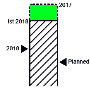
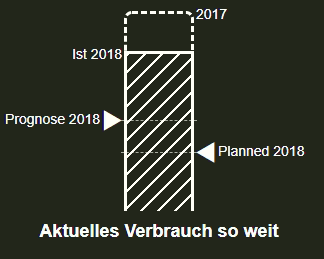

# ioBroker.vis-special-charts
============

Special chart widget for ioBroker.vis

## Changelog
### 0.2.4 (2018-06-09)
- (bluefox) Tooltips showed

### 0.2.2 (2018-05-06)
- (bluefox) initial checkin

## License
 Copyright (c) 2018 bluefox https://github.com/GermanBluefox <dogafox@gmail.com>, 
 
 Creative Common Attribution-NonCommercial (CC BY-NC)

 http://creativecommons.org/licenses/by-nc/4.0/

Short content:
Licensees may copy, distribute, display and perform the work and make derivative works based on it only if they give the author or licensor the credits in the manner specified by these.
Licensees may copy, distribute, display, and perform the work and make derivative works based on it only for noncommercial purposes.
(Free for non-commercial use).